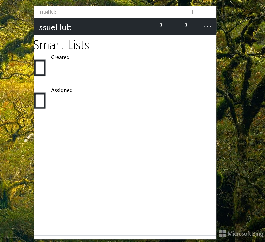
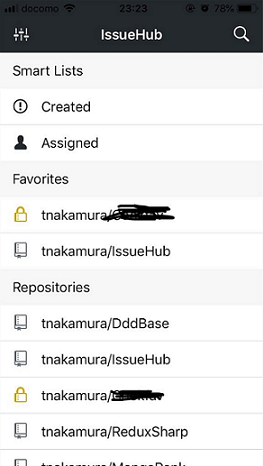

# IssueHubX

IssueHubX is the best way to browse and maintain your GitHub issues on any iPhone, old sweet WinPhone, and Android device too...

This is the part of Project Gemini.

## Screenshots

## Getting the application to build locally

Clone this repository to your local machine.

Fill your own GitHub client id and client secret.

Compile.

Fix the bugs. Profit =)

## Contributing

Contributions are absolutely welcome!
The project is built on Xamarin.
You'll need to download this to build the project.

1. Fork it!
2. Create your feature branch: `git checkout -b my-new-feature`
3. Commit your changes: `git commit -am 'Add some feature'`
4. Push to the branch: `git push origin my-new-feature`
5. Submit a pull request :D

## Credits

A log of thanks to many who contribute to open-source projects.
The following were instrumental to building this app:
- [IssueHub by Tnakamura](https://github.com/tnakamura/IssueHub)
- [Acr.UserDialogs](https://github.com/aritchie/userdialogs)
- [Octokit](https://github.com/octokit/octokit.net)
- [ReactiveProperty](https://github.com/runceel/ReactiveProperty)
- [ValueTaskSupplement](https://github.com/Cysharp/ValueTaskSupplement)
- [Xam.Forms.MarkdownView](https://github.com/dotnet-ad/MarkdownView)
- [Xamarin.Auth](https://github.com/xamarin/Xamarin.Auth)

## .

AS IS. No support. RnD only.

- [m][e] 2022

